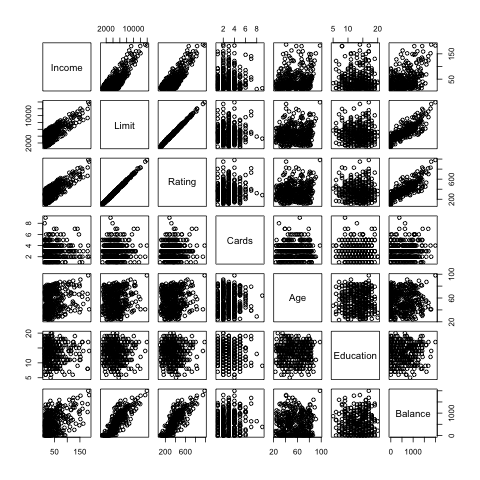

```{r setup, include=FALSE}
knitr::opts_chunk$set(echo = TRUE)
```

## Introduction ##

Through this project, we have tried to analyze the relationship between Balance and a set of given variables to understand the casual relationship between the average credit card debt across people and the major contributors to such. 

Note: This is similar to Chapter 6 of Introduction to Statistical Learning.

## Data

For this project, we will be using the Credit.csv data set available on the Introduction to Statistical Learning website: http://www-bcf.usc.edu/~gareth/ISL. It is also the same data set used in Chapter 6 of the book. 

The quantitative variables are: Balance, Income, Credit Limit, Credit Rating, No. of Cards, Age and Education.   
The qualitative variables are: Gender, Student Status, Married and Ethinicity.  

## Data - Continued

<center>

</center>

## Method

Given the _Credit_ data from the ISLR website, we have done some pre-modeling to massage it into a usable framework. 

1. We have converted the qualitative variables in quantitative dummies.
2. Mean centered the variables to 0
3. Standardized the variables to Standard Deviation of 1

We do this because we have used multiple regression models which would given different coefficient values for the same regressors. Keeping in mind the idea of apple-to-apple comparison, we have regularized these variables so the coefficients are all of the same scale. Hence, making it easier to interpret.


## Method - Continued
While analyzing this relationship, we haven't restricted ourselves to just OLS. We realize that other linear models can be more effective at describing such a relationship and hence we have used the following models:

* An OLS model
* A Ridge model - using 10-fold cross validation to select lambda  
* A Lasso model - using 10-fold cross validation to select lambda  
* A PCR model - using 10-fold cross validation to select the number of components
* A PLSR model - using 10-fold cross validation to select the number of components

## Method - Continued

Our criteria for judging these models is : Lowest MSE  
  
<center>
$MSE = Variance + Bias$    
</center>   
      
Given that the above models focus on reducing either Bias or Variance, we will finally use the model which provides the lowest MSE.

## Analysis

```{r eval=TRUE, echo=FALSE, message=FALSE}
library(xtable)
library(Matrix)

load(file = "../data/lm-model.RData")
load(file = "../data/ridge-models.RData")
load(file = "../data/lasso-models.RData")
load(file = "../data/pls-models.RData")
load(file = "../data/pcr-models.RData")

# read in original data, tests and training sets as well
data = as.matrix(read.csv("../data/scaled-credit.csv", row.names = 1))
x.train = as.matrix(read.csv("../data/xtrain.csv", row.names = 1))
y.train = as.matrix(read.csv("../data/ytrain.csv", row.names = 1))
x.test = as.matrix(read.csv("../data/xtest.csv", row.names = 1))
y.test = as.matrix(read.csv("../data/ytest.csv", row.names = 1))
```
Below is a table of the regression coefficients produced by each model on the full data along with a plot of all model coefficients:

```{r xtable, results = "asis", echo = FALSE, eval=TRUE, message=FALSE}
ridgeCoefs = as.matrix(ridgeModel$beta)
lassoCoefs = as.matrix(lassoModel$beta)
plsCoefs = as.matrix(plsModel$coefficients[,,bestPLS])
pcrCoefs = as.matrix(pcrModel$coefficients[,,bestPCR])
lmCoefs = as.matrix(linearModel$coefficients)
coefMatrix = cbind(lmCoefs, ridgeCoefs, lassoCoefs, plsCoefs, pcrCoefs)
colnames(coefMatrix) = c("lm", "ridge", "lasso", "pls", "pcr")
coefTable = xtable(coefMatrix)
print(coefTable, type = "html", comment = FALSE,  hline.after = c(1:10))
```

## Analysis - Continued 

To compare the coefficients of the different models graphically:
<center>
```{r results = "asis", echo = FALSE, eval=TRUE, message=FALSE}
plot(coefMatrix[,1], type = "b", col = "Blue", xaxt = "n", cex = .5, pch = 10, xlab = "", ylab = "Value")
abline(0,0, col = "grey")
points(coefMatrix[,2], type = "b", col = "Dark Red", cex = .5, pch = 10)
points(coefMatrix[,3], type = "b", col = "Dark Green", cex = .5, pch = 10)
points(coefMatrix[,4], type = "b", col = "Pink", cex = .5, pch = 10)
points(coefMatrix[,5], type = "b", col = "Black", cex = .5, pch = 10)
legend("top",legend = c("lm", "ridge", "lasso", "pca", "pls"), 
       fill = c("Blue", "Dark Red", "Dark Green", "Pink", "Black"))
text(seq(1, 11, by=1), par("usr")[3] - 0.2, labels = colnames(data)[1:11], srt = 75, pos = 1, xpd = TRUE, cex = .65)
```
</center>
## Analysis - Continued

Looking at the table and the graphs, we can see that the models reduce some of the coefficients to zero. This is because we have used the *shrinkage* and *dimension reduction* methods.

For example:
The `Education`, `GenderFemale`, `MarriedYes`, `EthnicityAsian`, and `EthnicityCaucasian` are all *meaningless* in our lasso regression. Therefore, by reducing the number of regressors in our model, Lasso allows us to easily interpret the results and increases the overall effectiveness of our model.

Ridge does the same with a different statistical formula (i.e, different penalty)

## Analysis - Continued

Partical Component Regression (PCR) and Partial Least Squares (PLS) methods produce nearly identical coefficeints, which we expect since they both use principle components effectively remove the correlation between any given regressors. Furthermore, PCR and PLS use similar numbers of components (10 and 9 respectively).

Now having looked at the coefficients, how do we decide what model to use?

## Result

```{r eval=TRUE, echo=FALSE, message=FALSE}
linearMSE = round(linearMSE,4)
cvRidgeMSE = round(cvRidgeMSE,4)
cvLassoMSE = round(cvLassoMSE,4)
cvPcrMSE = round(cvPcrMSE,4)
cvPlsMSE = round(cvPlsMSE,4)
```
To answer the question and to better address overall model effectiveness, we look at our main criteria: MSE

<center>
```{r, results = "asis", eval=TRUE, echo=FALSE, message=FALSE}
options(xtable.comment = FALSE)
# may add this chunk to RESULTS section instead of ANALYSIS
Model = c("OLS", "Ridge", "Lasso", "PCR", "PLS")
TestMSE = c(linearMSE, cvRidgeMSE, cvLassoMSE, cvPcrMSE, cvPlsMSE)
mseDF = cbind(Model, TestMSE)
mseTable = xtable(mseDF, caption = "Model Test MSE", digits = 5)
print(mseTable, type = "html", caption.placement = "top", comment = FALSE)
```
</center>  
   
Clearly, OLS is the worst model to use. And Ridge seems to work best with our data.

